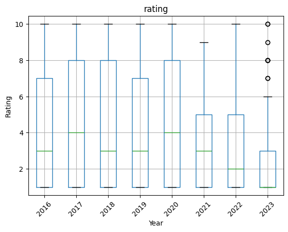

## Labmentix-Internship
## Project 3: DA CSAT DASHBOARD 

GOAL:
Mini end‑to‑end BI engagement
1.  design the data model
2. Clean it
3. Build a dashboard + story for PR and operations stakeholders

# Initial Questions to Solve:
How satisfied are passengers overall (CSAT) by traveller_type, seat_type, aircraft, and route?
Which service dimensions (cabin_staff_service, ground_service, food_beverages, seat_comfort, entertainment, value_for_money) drive low ratings?
How does satisfaction vary by country / continent / region of reviewer?
Are verified trips showing different satisfaction patterns than not verified trips?
Over time, are ratings improving or declining by year / quarter?

Workflow
# Import data to pANDAS Dataframe for basic Data Exploration
- Check the size of both dataset and datatypes
- Check for null values

traveller_type: 1 missing value (1323 non‑null of 1324).
In Countries, Code has 1 null

Will handle the missing value in Tableau by chnaging 
- from Traveller_type to "Unknown" 
-  ISO null Code of Sark to "CRQ"

## Import data into Tableau
ba_reviews.csv – 1324 rows, 19 columns (one row per review)
Countries.csv – 251 rows, 4 columns (country dimension)

## Connect both files
Connect → Text file → select ba_reviews.csv
Click Add → connect to Countries.csv

Both tables available in the data source pane

# Design the data model & E‑R logic

create a relationship ON the logical layer - CANVAS
ba_reviews.place → Countries.Country (string–string join)

This is logically a 1‑to‑many i.e 1 Country → many reviews
 Review (many) — belongs to — Country (one)

 # Data types and basic cleaning in Tableau
 ## Correct data types
In the Data Source tab, set:
date → Date.
date_flown → Date.
rating and all metric columns → Number (whole).
​trip_verified → String 

Double‑checked, there are no numeric columns stored as text

# Handle missing values, 
Create a calculated field traveller_type_clean:
IF ISNULL([traveller_type]) THEN "Unknown" ELSE [traveller_type] END

Create a calculated field ISO_CODE_clean:
IF ISNULL([CODE]) THEN "CRQ" ELSE [CODE] END

# HANDLE OUTLIERS

“Created a Boolean field valid_review that is TRUE when overall rating is between 1–10 and all service metrics are between 1–5;

// TRUE if rating is 1–10 and all service metrics are 1–5
IF 
    [rating]              >= 1 AND [rating]              <= 10 AND
    [seat_comfort]        >= 1 AND [seat_comfort]        <= 5  AND
    [cabin_staff_service] >= 1 AND [cabin_staff_service] <= 5  AND
    [food_beverages]      >= 1 AND [food_beverages]      <= 5  AND
    [ground_service]      >= 1 AND [ground_service]      <= 5  AND
    [value_for_money]     >= 1 AND [value_for_money]     <= 5  AND
    [entertainment]       >= 1 AND [entertainment]       <= 5
THEN 
    TRUE
ELSE 
    FALSE
END

Use valid_review as a global filter with two good options.

Option A – Filter on each worksheet (simple)
Drag valid_review from the Data pane to the Filters shelf.
In the dialog, tick only True → OK.
​
Right click valid_review on the Filters shelf → Apply to Worksheets → All Using This Data Source.
Now every sheet and dashboard using this data source will only show records where valid_review = True (so all invalid/out‑of‑range ratings are excluded)

Option B – Data Source filter (more “model‑level”)
Go to the Data Source tab.
At top right, click Add under “Filters…”.
Choose the field: valid_review.
In the filter dialog, select True → OK.

This becomes a data source filter: all analyses built from this data source will automatically exclude invalid reviews

USE: Used it as a global data source filter (valid_review = TRUE) to remove outliers and invalid scores from all dashboards

## TEXT AND FORMATING CLEANUP

# Spelling & standardization
traveller_type: “Couple Leisure”, “Business”, etc.
seat_type: “Economy Class”, “Business Class”, “First Class”.
trip_verified: “Verified”, “Not Verified”

No need for grouping / aliasing in Tableau, since all columns had consistent capitalization

# New date fields
Created
Review Year = DATEPART('year', [date])
Review Month = DATETRUNC('month', [date])
Flight Year = DATEPART('year', [date_flown])

For trend charts and filters