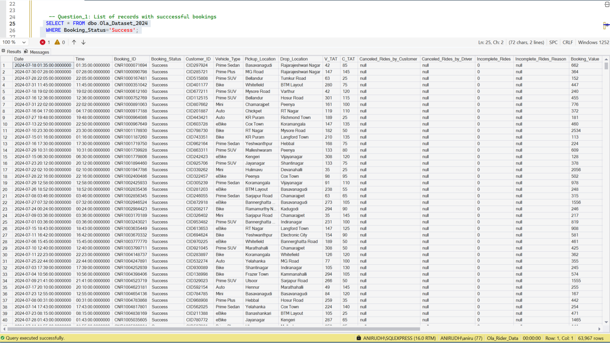
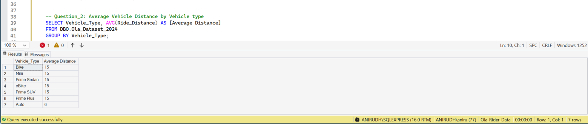
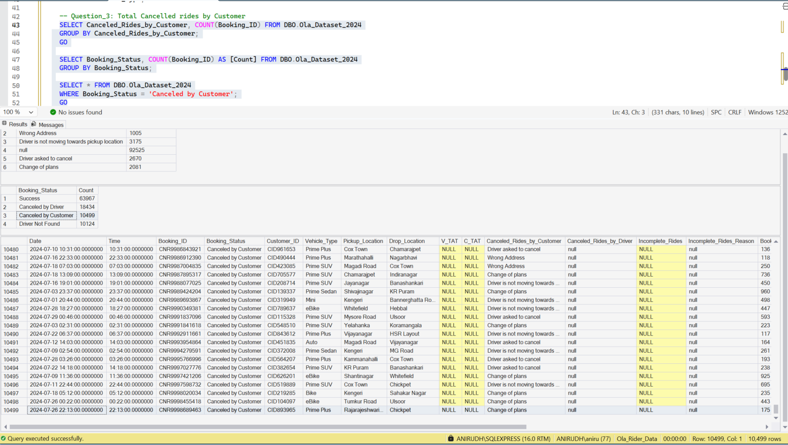
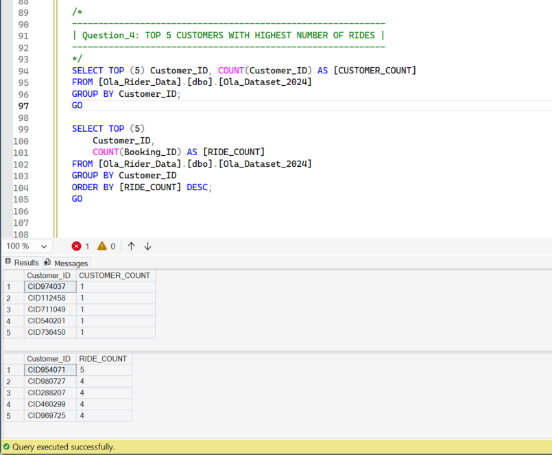
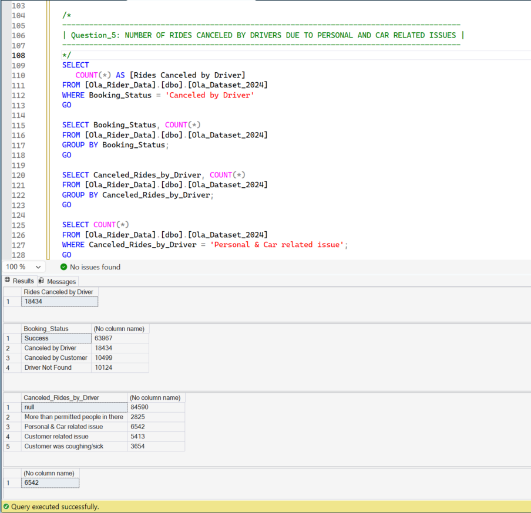
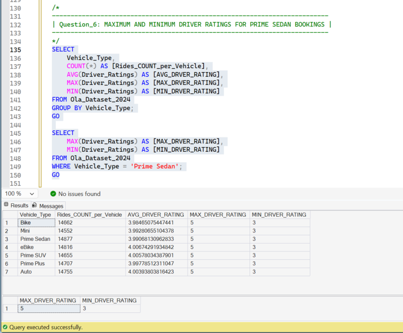
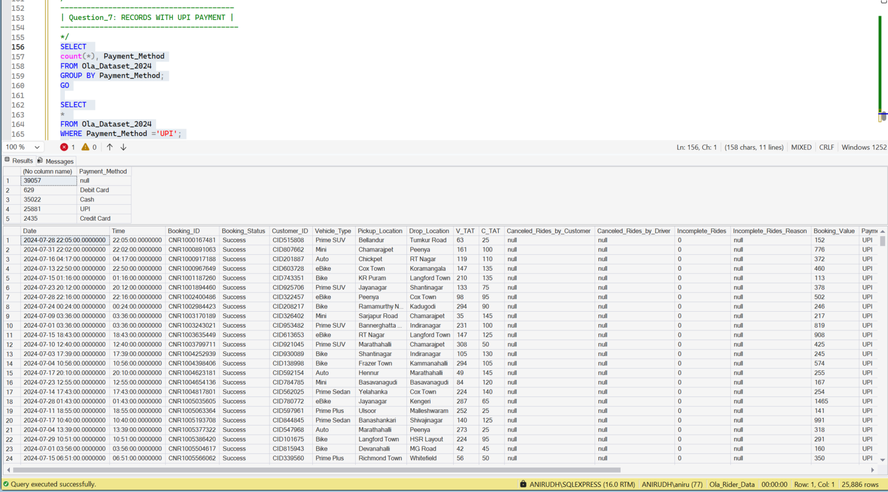
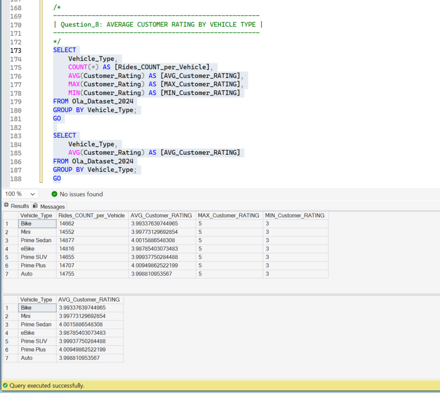
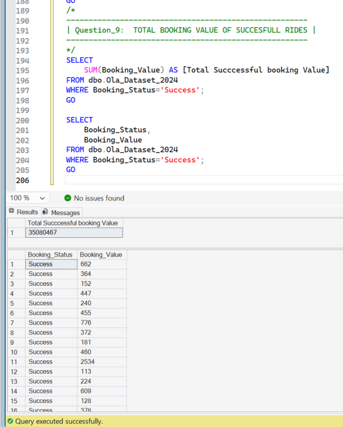
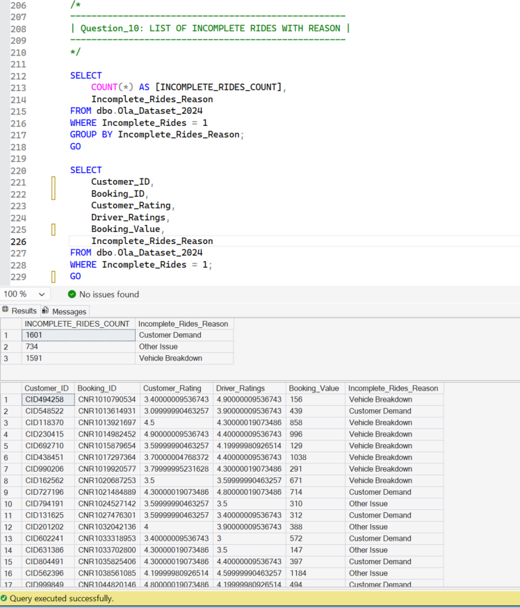

# 🚖 Ola Ride-Sharing Data Analytics (July 2024)

## 📌 Project Overview
This project involves a comprehensive analysis of a ride-sharing dataset. The primary goal is to extract actionable insights regarding revenue performance, cancellation patterns, and operational bottlenecks.

The project transitions from 
Raw Data ➡️ Strategic Preprocessing ➡️ SQL Analysis ➡️ Dynamic Visualization.

**Format:** CSV (Comma Separated Values)  
**Rows:** ~103,000 records  
**Columns:** 21 features  
**Date Range:** July 2024  
**Domain:** Transportation / Gig Econom

## 📝 Column Descriptors

| Column Name | Data Type | Description |
| :--- | :--- | :--- |
| `Date` | **Date** | The specific calendar date of the booking. |
| `Time` | **Time** | The timestamp when the booking was requested. |
| `Booking_ID` | **String** | A unique identifier for every booking request. |
| `Booking_Status` | **Categorical** | Final status: `Success`, `Cancelled by Customer`, or `Cancelled by Driver`. |
| `Customer_ID` | **String** | Unique identifier for the customer (Anonymized). |
| `Vehicle_Type` | **Categorical** | Category: *Auto, Prime Sedan, Mini, Bike, eBike, Prime SUV*. |
| `Pickup_Location` | **String** | The area where the customer requested pickup. |
| `Drop_Location` | **String** | The destination area. |
| `V_TAT` | **Integer** | **Vehicle Turnaround Time**: Time taken (s) for driver to accept. |
| `C_TAT` | **Integer** | **Customer Turnaround Time**: Time taken (s) for customer to board. |
| `Cancelled_R_by_Cust` | **String** | Reason for customer cancellation (e.g., *Change of plans*). |
| `Cancelled_R_by_Drvr` | **String** | Reason for driver cancellation (e.g., *Personal & Car issues*). |
| `Incomplete_Rides` | **Binary** | Started trips not completed (`1` = Yes, `0` = No). |
| `Incomplete_R_Reason` | **String** | Reason for premature end (e.g., *Vehicle Breakdown*). |

---

## 🛠 Strategic Data Cleaning & Observations

> [!IMPORTANT]
> **Observation on Missing Data:** Nearly **38%** of core ride metrics (Ratings, Payment Method, TAT) contain null values.

In ride-sharing analytics, Nulls are often **"Conditional"** rather than "Missing":
* **The Logic:** If a `Booking_Status` is marked as `Cancelled`, it is logically impossible to have a `Driver_Rating`, `V_TAT`, or `Payment_Method`.
* **The Strategy:** Instead of dropping rows, we treat these as **Categorical Absences**.
  * **Incomplete Rides:** We identified `39,057` records where ratings are missing, matching the count of non-success records exactly.

---

# 🔍 SQL Insights & Business Questions
The data was migrated to SQL Server (SSMS) to perform high-performance querying. 
We processed **103.02K total booking attempts** and below are the key findings through SQL using **SSMS 22 (SQL Server Management Studio 22):**

---

## Booking Success Rate
Tracking the volume of rides that successfully reached the destination

Approximately 62% of bookings resulted in a successful ride (63,967 records)

---

## Vehicle Performance (Distance)
Identifying which vehicle types are preferred for long-distance vs. short-distance travel.

---

## Customer Cancellation Trends

Analyzed the primary reasons why 10.5k rides were canceled by customers
- Most frequently canceled because the "Driver was not moving towards the pickup location" (3,175 cases).
- Found that there were 10.1k instances where "no driver was found"
---

# Loyalty Analysis (Top 5 Customers)
Identifying the power users with the highest ride frequency

Our most frequent customer (CID954071) completed 5 rides, indicating a highly fragmented but active user base

---

## Driver Behavior & Operational Issues

The primary reason for driver-initiated cancellations was "Personal & Car related issues," accounting for 6,542 cases

---

# Customer Satisfaction by Category for PrimeSedan
Analyzed how ratings fluctuate across different vehicle types, specially for premium segments like Prime Sedan. This helps identify if specific segments (like *Auto* or *Bike*) require better driver training

---

# UPI_Payment_Records
Rides where payment was made using UPI

---

# Avg_CustomerRatingBy_VehicleType

---

# Total_Bookingvalue (Revenue Realization)
This metric quantifies the "Actual Revenue" generated from successful bookings

---

# Incomplete Ride Deep-Dive
A specialized breakdown of rides that started but failed to finish. This distinguishes between **mechanical failures** (Vehicle Breakdown) and **behavioral issues** (Customer Demand)

We recorded 3,926 incomplete rides, with "Vehicle Breakdown" and "Customer Demand" being the leading causes

---

## Power BI Visualisations for real-time decision making

# Slide 1: Dashboard Overview 
To have a quick look at the Financial Health, we can say that "OLA" The generated $35 Million in revenue, but we also observed a $21 Million revenue loss due to cancellations and "Driver Not Found" errors
Besides, if we see the bookings, which was upside 100k for the july 2024 month alone around Bangalore and nearby regions and has not being steady rather inceasing and decreasing every other day, and week.

# Slide 2: Vehicle types effect on Revenue
Most 4-wheelers and bike / e-bikes maintain an average ride distance of 24 - 25 kms, while Auto-rickshaws average significantly lower at 10 kms and total distance travalled being 92K kms 
The boooking cancellations has been steady over and under 3.5 Million for each vehicle type including auto

# Slide 3: Revenue & Payment Analysis
The revenue earned within the 1st 3 days of the month July was over 3.5 Million with 10k+ bookings and ~2 Million Revenue loss due to cancellations and issues. the mejorly of the revenue flow is through Cash making 1.9 million, followed by 1.44M for UPI and rest 0.2 Million apporx through cards
The top customers with max distance travelled for around 48kms 

# Slide 4: Booking Cancellations
From over 103K bookings, only 64k were succesful, approximaltel, givng the cancellation rate 28.8%. Out of the number of bookings mentioned, 10.12k were incomplete because of "Driver Not found" which means cost issue in that area or/ resource needs to aligned more 

If we check from cancelled rodes by Driver overall, the majorly has been hot by Personal and car issues  follwing by 30% approx for custmer related issues. Aother uissues that can be avoided with change in the user intergace i.e mentioning the no. of customers permitted, since 15.3% of rides were cancellled because of outnumber for a single vehicle accomodation for ride

Next, for the cancellations by customer, thge majorly has been locked by Most frequently canceled givng reason "Driver was not moving towards the pickup location". This needs to be seen closely to understand if it was because of driver already dropping off other customer or/ because of his break but still accepted the ride?
The Unexpected occasionbs has also been of "Change of plans" which can not be predicted. but still it affected our score by 20% downwards.  Then also a scenarior where the Driver asked the Customer to canvel has also been on  hogher edge making ot 25.4% i.e 2670 rides cancellations by customer

# Slide 5: Driver & Customer Experience evaluated through Ratings
The "Quality" Gap: By comparing Customer vs. Driver ratings in a line chart, we can see if specific vehicle types (like Prime Plus) provide a better experience than others.
Visualizing Satisfaction: The dashboard uses table rows to pinpoint exactly which vehicle categories are underperforming in ratings, enabling targeted driver training
Across all vehicle types, both driver and customer ratings are remarkably consistent, hovering around the 4.0 mark

# Slide 3: Vehicle Performance & Revenue
Most 4-wheelers and e-bikes maintain an average ride distance of 15 units, while Auto-rickshaws average significantly lower at 6 units
Across all vehicle types, both driver and customer ratings are remarkably consistent, hovering around the 4.0 mark
Our most frequent customer (CID954071) completed 5 rides, indicating a highly fragmented but active user base

# Slide 6: Driver & Customer Experience (Ratings)
The "Quality" Gap: By comparing Customer vs. Driver ratings in a line chart, we can see if specific vehicle types (like Prime Plus) provide a better experience than others. But to surprise, across all vehicle types, both driver and customer ratings are remarkably consistent, hovering around the 4.0 mark
To Visualizing Satisfaction, individually, I used table rows to pinpoint exactly which vehicle type  underperformed in ratings, and during which day of the month and for which route? This will help to take the required action to get better ratings

## Strategic Recommendations
Based on the combined SQL and Power BI Analysis:
  - Reduce Revenue Leakage: With $21M lost to cancellations, we need to implement a "Driver Arrival" incentive to fix the #1 customer complaint (drivers not moving).
  - Optimize Auto-Rickshaws: Since Autos have a much shorter average distance, they should be marketed for "last-mile connectivity" rather than long-range trips
  - UPI is a dominant force with over 19M+ transactions. However, Cash remains the highest single payment method (14.17M), showing a need to support both digital and traditional users
  - Address Vehicle Breakdowns: 6.5k rides failed due to breakdowns which was 35% camcellations by Driver. A mandatory vehicle health check-in the app could reduce this friction.

# Final Insights
Our SQL analysis confirms that while we are hitting a high volume of 103K bookings, our biggest growth opportunity lies in the $21 Million 'Lost Revenue' gap. 
By using the Power BI filters for pickup and drop-off locations more deeply, we can identify exactly which zones have the highest 'Driver Not Found' rates and deploy more fleet resources to those specific areas."