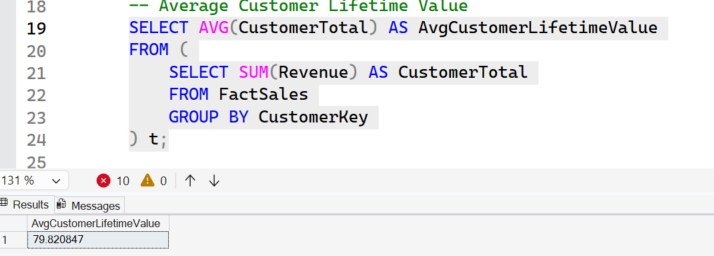
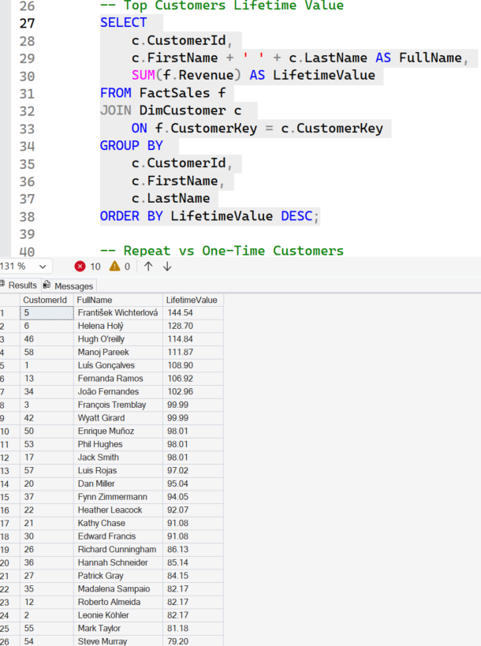
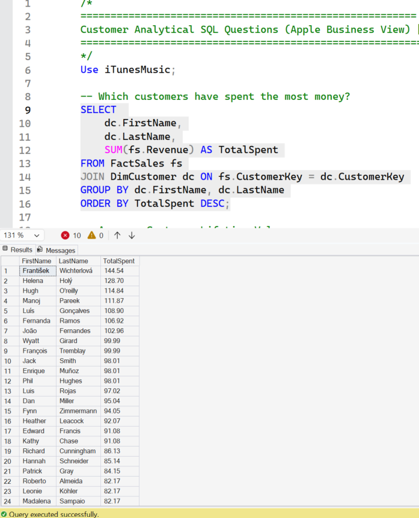
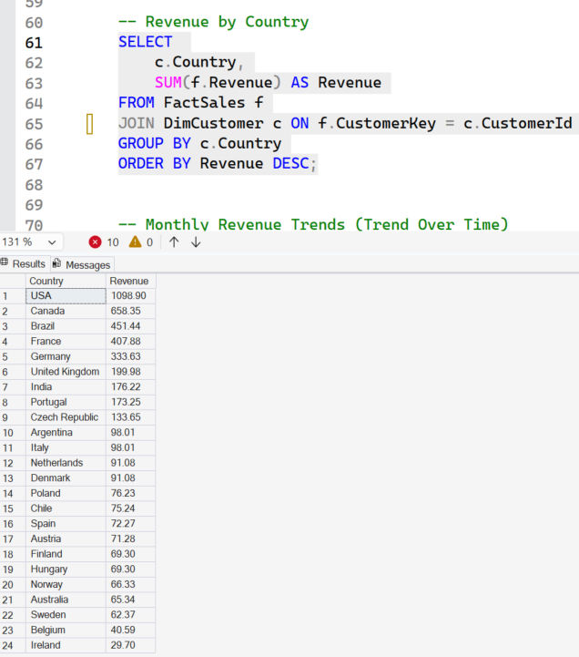
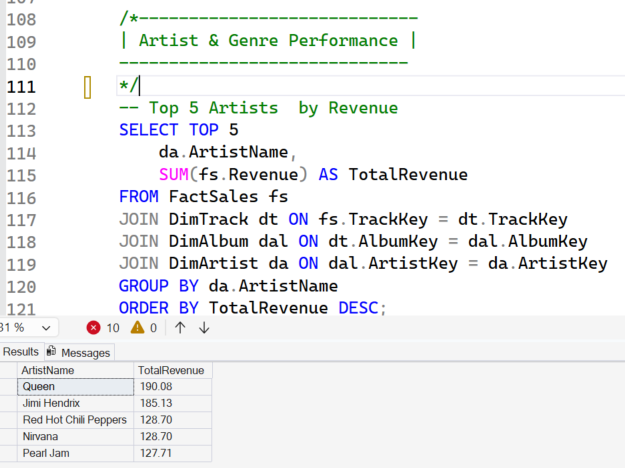
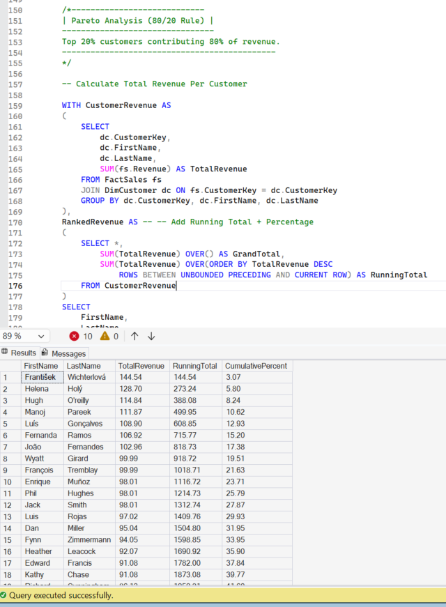

# 🎵 iTunes Music Store -- End-to-End SQL Data Warehouse Project

------------------------------------------------------------------------

# 📌 Project Overview

This project demonstrates the design and implementation of a complete
SQL-based Data Warehouse pipeline using the iTunes Music Store dataset.

The solution follows a modern layered architecture:

Raw Layer → Staging Layer → Warehouse Layer (Star Schema) → Analytical
SQL

## Layer Discipline Summary

| Layer     | FK?     | PK?  | Strict Types? | Keys Used                     |
| --------- | --------| -----| ------------- |------------------------------ |
| Raw       | ❌      | ❌  | ❌            | No keys enforced              |
| Staging   | PK only | ✅  | ✅            | Business keys only            |
| Warehouse | PK + FK | ✅  | ✅            |Surrogate keys + business keys |

------------------------------------------------------------------------

# 🧪 Technologies Used

-   SQL Server
-   T-SQL
-   Stored Procedures
-   Window Functions
-   Star Schema Modeling
-   Tableau (Visualization)  (To be worked on)

------------------------------------------------------------------------

# 🏗 Architecture Overview

## 🥇 Layer 1 --- Raw Landing Layer

**Design Philosophy**

-   Created raw landing tables and used BULK INSERT to ingest CSV data
    into SQL Server.
-   Enforced UTF-8 encoding and controlled header skipping.
-   The raw layer isolates source data before transformation into
    staging and warehouse layers.

**Engineering Principles**

-   Source data is first loaded into a VARCHAR-based raw layer.
-   Type-safe transformations are applied later using TRY_CAST and
    TRY_CONVERT.
-   Prevents ETL failure due to malformed source data.
-   Preserves full source fidelity for lineage and auditability.
-   Even unused tables are loaded to ensure future extensibility.

**Validation Controls**

-   Row count reconciliation
-   Duplicate detection on business keys
-   Null validation
-   Type safety checks using TRY_CAST
-   Referential integrity validation before warehouse enforcement

**Operational Logging**

-   Captured row-level metrics using @@ROWCOUNT after each insert.
-   Logged results into centralized ETLLog table.
-   Enables proactive detection of missing files, partial loads, or
    abnormal spikes.

------------------------------------------------------------------------

## 🥈 Layer 2 --- Staging Layer

**Purpose**

-   Intermediate transformation layer.
-   Data cleansing and business-key preservation.
-   No foreign keys to avoid load-order dependency.

**Design Decisions**

-   Time granularity not required → Used DATE instead of DATETIME for
    efficiency.
-   CREATE PROCEDURE registers ETL logic.
-   Execution occurs only when invoked using EXEC.
-   Each staging step logs row counts and execution status for
    auditability.

------------------------------------------------------------------------

## 🥇 Layer 3 --- Warehouse Layer (Star Schema)

**Modeling Strategy**

-   Implemented surrogate key-based star schema.
-   FactSales table separated from dimensions.
-   Snowflaked hierarchy: Track → Album → Artist.
-   Foreign keys enforced only in warehouse.

**Why Surrogate Keys?**

-   Improves performance.
-   Protects against source system key changes.
-   Enables future SCD implementation.
-   Decouples analytics from source volatility.

**Full Reload Strategy**

-   Implemented full reload for simplicity.
-   Used DELETE instead of TRUNCATE due to FK constraints.
-   In enterprise systems, incremental loads with SCD Type 2 would be
    recommended.

## Options Available
| Method      | Complexity | Performance | History Tracking |
| ----------- | ---------- | ----------- | ---------------- |
| Full Reload | Low        | Medium      | No               |
| SCD Type 2  | Medium     | Medium      | Yes              |
| Incremental | High       | High        | Optional         |

------------------------------------------------------------------------

# 📊 Data Model (Clean Warehouse Design)

## 📈 Fact Table

-   FactSales
    -   DateKey
    -   CustomerKey
    -   TrackKey
    -   EmployeeKey
    -   Quantity
    -   UnitPrice
    -   Revenue

## 📘 Dimension Tables (Snowflake Style)

-   DimArtist
-   DimAlbum → FK to DimArtist
-   DimTrack → FK to Album, Genre, MediaType
-   DimGenre
-   DimMediaType
-   DimCustomer → FK to Employee
-   DimEmployee
-   DimDate

------------------------------------------------------------------------

# 📊 Final Warehouse Counts

  Table        | Rows |
  -------------|------|
  DimArtist    | 275   |
  DimAlbum     | 347
  DimGenre     | 25
  DimTrack     | 3503
  DimCustomer  | 59
  DimEmployee  | 9
  DimDate      | 503
  FactSales    | 4757

------------------------------------------------------------------------


# 🧠 Key Design Decisions

### ✅ Surrogate Keys
Used for: - Performance - Data stability - SCD extensibility

### ✅ Foreign Keys Only in Warehouse
Raw & Staging: - No FK (ensures load stability)
Warehouse: - FK enforced for referential integrity

### ✅ Delete Instead of Truncate
Because warehouse tables use FK constraints.

------------------------------------------------------------------------

# 📊 Business Questions Answered

## 1️⃣ Customer Analytics

### Average Customer Lifetime Value
Used grouped aggregation over FactSales.

``` sql
SELECT AVG(CustomerTotal) AS AvgCustomerLifetimeValue
FROM (
    SELECT SUM(Revenue) AS CustomerTotal
    FROM FactSales
    GROUP BY CustomerKey
) t;
```


------------------------------------------------------------------------

### Top Customers by Lifetime Value

``` sql
SELECT 
    c.CustomerId,
    c.FirstName + ' ' + c.LastName AS FullName,
    SUM(f.Revenue) AS LifetimeValue
FROM FactSales f
JOIN DimCustomer c 
    ON f.CustomerKey = c.CustomerKey
GROUP BY c.CustomerId, c.FirstName, c.LastName
ORDER BY LifetimeValue DESC;
```



------------------------------------------------------------------------

## 2️⃣ Sales & Revenue

### Customers Most Revenue


### Monthly Revenue Trend
Built date-driven revenue time series analysis

``` sql
SELECT 
    d.Year,
    d.Month,
    SUM(fs.Revenue) AS MonthlyRevenue
FROM FactSales fs
JOIN DimDate d ON fs.DateKey = d.DateKey
GROUP BY d.Year, d.Month
ORDER BY d.Year, d.Month;
```



------------------------------------------------------------------------

### 🔹 Artist & Genre Revenue Analysis

Identified top-performing artists and revenue-driving genres.



------------------------------------------------------------------------


## 3️⃣ Pareto Analysis (80/20 Rule)
Used window functions to compute cumulative revenue distribution and
identified top contributing customers.

``` sql
WITH CustomerRevenue AS
(
    SELECT
        dc.CustomerKey,
        SUM(fs.Revenue) AS TotalRevenue
    FROM FactSales fs
    JOIN DimCustomer dc ON fs.CustomerKey = dc.CustomerKey
    GROUP BY dc.CustomerKey
),
RankedRevenue AS
(
    SELECT *,
        SUM(TotalRevenue) OVER() AS GrandTotal,
        SUM(TotalRevenue) OVER (ORDER BY TotalRevenue DESC
            ROWS BETWEEN UNBOUNDED PRECEDING AND CURRENT ROW) AS RunningTotal
    FROM CustomerRevenue
)
SELECT *
FROM RankedRevenue;
```




------------------------------------------------------------------------

# 💼 Few Articulation / Learning Points

-   Loaded source data into a VARCHAR-based raw layer first, then
    performed type-safe transformations in staging using TRY_CAST
-   The raw layer preserves full source fidelity and ensures data
    lineage
-   Implemented a surrogate key-based star schema (dimensional model) to optimize
    analytical queries
-   Referential integrity is enforced only in the warehouse to avoid
    load-order dependencies
-   For this project, I implemented full reload, but enterprise systems
    would use incremental loads with SCD Type 2
-   TRUNCATE cannot be executed on parent tables referenced by foreign
    keys, so I switched to DELETE for full reload
-   Used window functions to compute cumulative revenue distribution
    and perform Pareto analysis
-   I built a SQL-based Star Schema warehouse using PascalCase naming
    standards
-   Transactional invoice data was separated into a FactSales table
    with normalized dimensions for Customer, Artist, Album, Genre, and
    Date
-   Implemented logging framework
-   Performed advanced analytics (Pareto, CLV, Revenue trends)

## Usage of SQL helpers

| Object               | Returns Data? | Modifies Data?    | Reusable? | Used Inside SELECT? | Best For              |
| -------------------- | ------------- | ------------------| --------- | ------------------- | --------------------- |
| **Function**         | ✅ Yes        | ❌ No (mostly)  | ✅ Yes    | ✅ Yes              | Reusable calculations |
| **Stored Procedure** | Optional       | ✅ Yes          | ✅ Yes    | ❌ No              | ETL / Batch process   |
| **CTE**              | ✅ Yes         | ❌ No           | ❌ No     | ✅ Yes             | Temporary query logic |
| **View**             | ✅ Yes         | ❌ No           | ✅ Yes    | ✅ Yes             | Virtual table         |

------------------------------------------------------------------------

# 🚀 Conclusion

This project demonstrates strong expertise in:

-   Data Engineering
-   Dimensional Modeling
-   SQL Analytics
-   ETL Architecture
-   Logging & Auditability
-   BI Readiness

The solution is scalable, maintainable, and production-ready for
analytical workloads.

------------------------------------------------------------------------

⭐ End of Documentation ⭐
